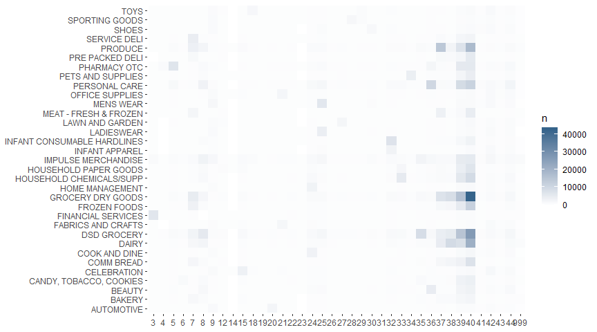

Comprensión del negocio
================
Fernando Arreola
16/12/2019

# Comprención del Negocio

## Antecedentes

Wal-Mart Stores, Inc. se dedica a negocios minoristas y mayoristas.
Opera a través de los siguientes segmentos comerciales: Walmart U.S.,
Walmart International y Sam’s Club. El segmento Walmart de EE. UU.
incluye operaciones de tiendas minoristas y *e-commerce* en EE. UU.
También ofrece servicios financieros y productos relacionados, como
giros postales, tarjetas prepagas, transferencias bancarias, cambio de
cheques y pago de facturas.

El segmento de Walmart International se clasifica en operaciones
minoristas, mayoristas y de otros formatos fuera de los EE. UU. Estas
categorías incluyen supercentros, supermercados, hipermercados, clubes
de almacenes, Sam’s Clubs, efectivo y transporte, mejoras para el hogar,
electrónica especializada, tienda de ropa, farmacias, tiendas de
conveniencia y *e-commerce*.

El segmento de Sam’s Club comprende clubes de almacenes solo para
miembros y samsclubs.com. Ofrece servicios especializados, compra de
automóviles, farmacia, óptica, centros de audífonos, centros de
neumáticos y baterías, y servicios de soporte de operaciones
comerciales. La compañía fue fundada por Samuel Moore Walton y James
Lawrence Walton el 2 de julio de 1962 y tiene su sede en Bentonville,
AR.

## Determinación del objetivo

El objetivo de la competencia es categorizar las visitas de compras
basado en los productos que ha adquirido el cliente, por ejemplo ‘visita
para una pequeña cena’, ‘visita para comprar regalos’, etc.

Walmart ya ha categorizado los viajes contenidos en estos datos dentro
de 38 distintos tipos, usando un metodo propio en un extenso conjunto de
datos.

El reto es reproducir esta categorización con un conjunto de
características más limitado. Esto puede proveer nuevas y más robustas
maneras de categorizar los datos.

## Determinación del criterio de éxito

La predicción se evalúa usando la pérdida logarítmica multiclase. Por
cada visita se debe ingresar un conjunto de probabilidades por cada
*tipo de viaje*.

# Compresión de los datos.

## Análisis Exploratorio de datos

Empezamos viendo la estructura de la tabla de entrenamiento.

``` r
head(train)
```

    ## # A tibble: 6 x 7
    ##   TripType VisitNumber Weekday     Upc ScanCount DepartmentDescr~
    ##   <fct>          <dbl> <fct>     <dbl>     <dbl> <chr>           
    ## 1 999                5 Friday  6.81e10        -1 FINANCIAL SERVI~
    ## 2 30                 7 Friday  6.05e10         1 SHOES           
    ## 3 30                 7 Friday  7.41e 9         1 PERSONAL CARE   
    ## 4 26                 8 Friday  2.24e 9         2 PAINT AND ACCES~
    ## 5 26                 8 Friday  2.01e 9         2 PAINT AND ACCES~
    ## 6 26                 8 Friday  2.01e 9         2 PAINT AND ACCES~
    ## # ... with 1 more variable: FinelineNumber <dbl>

*TripType* es la etiqueta sobre la que se deben clasificar cada una de
las visitas, identificadas por la variable *VisitNumber*. *Weekday* es
el día de la semana en el que se realizó la visita. *Upc* es el código
universal del producto, que identifica sobre qué producto se hizo la
transacción. *ScanCount* es el número de artículos vendidos (siendo
devolución cuando este número es negativo). Tanto
*DepartmentDescription* como *FilelineNumber* identifican el
departaminto y subdepartamento al que pertenece el artículo.

Ahora veamos algunas propiedades del conjunto de
    datos.

``` r
str(train)
```

    ## Classes 'spec_tbl_df', 'tbl_df', 'tbl' and 'data.frame': 647054 obs. of  7 variables:
    ##  $ TripType             : Factor w/ 38 levels "3","4","5","6",..: 38 23 23 19 19 19 19 19 19 19 ...
    ##  $ VisitNumber          : num  5 7 7 8 8 8 8 8 8 8 ...
    ##  $ Weekday              : Factor w/ 7 levels "Monday","Tuesday",..: 5 5 5 5 5 5 5 5 5 5 ...
    ##  $ Upc                  : num  6.81e+10 6.05e+10 7.41e+09 2.24e+09 2.01e+09 ...
    ##  $ ScanCount            : num  -1 1 1 2 2 2 1 1 1 -1 ...
    ##  $ DepartmentDescription: chr  "FINANCIAL SERVICES" "SHOES" "PERSONAL CARE" "PAINT AND ACCESSORIES" ...
    ##  $ FinelineNumber       : num  1000 8931 4504 3565 1017 ...
    ##  - attr(*, "spec")=
    ##   .. cols(
    ##   ..   TripType = col_factor(levels = c("3", "4", "5", "6", "7", "8", "9", "12", "14", "15", "18", 
    ##   ..     "19", "20", "21", "22", "23", "24", "25", "26", "27", "28", "29", 
    ##   ..     "30", "31", "32", "33", "34", "35", "36", "37", "38", "39", "40", 
    ##   ..     "41", "42", "43", "44", "999"), ordered = FALSE, include_na = FALSE),
    ##   ..   VisitNumber = col_double(),
    ##   ..   Weekday = col_factor(levels = c("Monday", "Tuesday", "Wednesday", "Thursday", "Friday", "Saturday", 
    ##   ..     "Sunday"), ordered = FALSE, include_na = FALSE),
    ##   ..   Upc = col_double(),
    ##   ..   ScanCount = col_double(),
    ##   ..   DepartmentDescription = col_character(),
    ##   ..   FinelineNumber = col_double()
    ##   .. )

En la tabla anterior podemos ver que existen 38 diferentes tipos de
visitas, así como 69 departamentos distintos. A continuación veremos
algunas estadísticas de los
    datos.

``` r
summary(train)
```

    ##     TripType       VisitNumber          Weekday            Upc           
    ##  40     :174164   Min.   :     5   Monday   : 83130   Min.   :8.340e+02  
    ##  39     : 95504   1st Qu.: 49268   Tuesday  : 72529   1st Qu.:3.400e+09  
    ##  37     : 38954   Median : 97074   Wednesday: 71115   Median :7.050e+09  
    ##  38     : 29565   Mean   : 96168   Thursday : 67962   Mean   :3.061e+10  
    ##  25     : 27609   3rd Qu.:144316   Friday   : 96247   3rd Qu.:3.007e+10  
    ##  7      : 23199   Max.   :191347   Saturday :122096   Max.   :9.790e+11  
    ##  (Other):258059                    Sunday   :133975   NA's   :4129       
    ##    ScanCount       DepartmentDescription FinelineNumber
    ##  Min.   :-12.000   Length:647054         Min.   :   0  
    ##  1st Qu.:  1.000   Class :character      1st Qu.:1404  
    ##  Median :  1.000   Mode  :character      Median :3352  
    ##  Mean   :  1.109                         Mean   :3727  
    ##  3rd Qu.:  1.000                         3rd Qu.:5501  
    ##  Max.   : 71.000                         Max.   :9998  
    ##                                          NA's   :4129

De las estadísticas mostradas es importante hacer notar que el número de
cada tipo de visitas es inexacto, dado que cada observación de la tabla
de datos es por transacción y no por visita. El número de visitas
registradas son solo 95674. También es interesante ver el número de
ventas por tipo de visita. Abajo se muestra el tanto del número de
visitas como el número de transacciones y las ventas como el por tipo de
de viaje.

``` r
p1 <- train %>%
  group_by(TripType) %>% 
  summarise(n = n_distinct(VisitNumber)) %>% 
  ggplot() +
  geom_bar(aes(x = TripType, y = n), stat = 'identity') +
  labs(title = 'Número de visitas por tipo de viaje') +
  theme_hc() +
  theme(plot.title = element_text(hjust = 0.5),
        axis.title.x = element_blank(),
        axis.title.y = element_blank())

p2 <- train %>%
  group_by(TripType) %>% 
  summarise(n = n()) %>% 
  ggplot() +
  geom_bar(aes(x = TripType, y = n), stat = 'identity') +
  labs(title = 'Transacciones por tipo de viaje') +
  theme_hc() +
  theme(plot.title = element_text(hjust = 0.5),
        axis.title.x = element_blank(),
        axis.title.y = element_blank())

p3 <- train %>%
  group_by(TripType) %>% 
  summarise(n = sum(ScanCount)) %>% 
  ggplot() +
  geom_bar(aes(x = TripType, y = n), stat = 'identity') +
  labs(title = 'Ventas por tipo de viaje') +
  theme_hc() +
  theme(plot.title = element_text(hjust = 0.5),
        axis.title.x = element_blank(),
        axis.title.y = element_blank())

grid.arrange(p1,p2,p3,nrow=3)
```

<!-- -->

A esta información podemos agregar el día de la semana

``` r
train %>%
  group_by(TripType, Weekday) %>% 
  summarise(n = n_distinct(VisitNumber)) %>% 
  ggplot() +
  geom_bar(aes(x = TripType, y = n), stat = 'identity') +
  facet_wrap(~Weekday) +
  theme_hc()
```

<!-- -->

Hay 97715 distintos tipos de productos en los datos Hay 69 distintos
tipos de productos en los datos

Ahora veamos la relación entre el tipo de viaje y el Departament, con
base el número de artículos comprados.

``` r
train %>%
  group_by(TripType, DepartmentDescription) %>% 
  summarise(n = sum(ScanCount)) %>% 
  semi_join(train %>% group_by(DepartmentDescription) %>% summarise(n=n()) %>% filter(n>5000),
            by = 'DepartmentDescription') %>% 
  ggplot(aes(x = TripType, y = DepartmentDescription, fill = n)) +
  geom_tile() +
  scale_fill_continuous(low="white", high="steelblue4") +
  theme(axis.title.x = element_blank(),
      axis.title.y = element_blank(),
      panel.background = element_rect(fill = "white"))
```

<!-- -->
