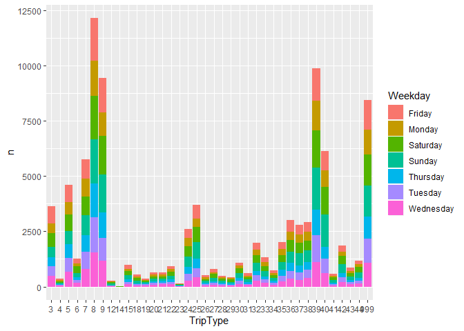
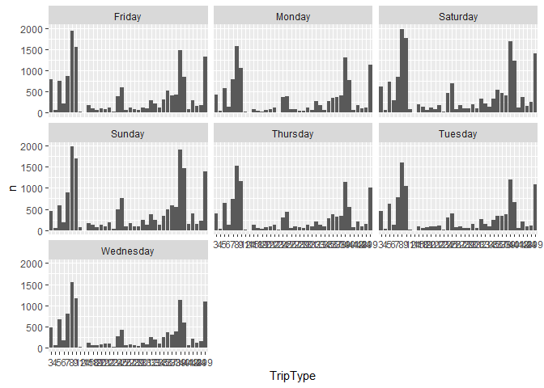

Comprensión del negocio
================
Bruno C. Gonzalez
16/12/2019

# Antecedentes

El objetivo de la competencia es categorizar las visitas de compras
basado en los productos que ha adquirido el cliente, por ejemplo ‘visita
para una pequeña cena’, ‘visita para comprar regalos’, etc.

Walmart ya ha categorizado los viajes contenidos en estos datos dentro
de 38 distintos tipos, usando un metodo propio en un extenso conjunto de
datos. El reto es reproducir esta categorización con un conjunto de
características más limitado. Esto puede proveer nuevas y más robustas
maneras de categorizar los datos.

Primero cargamos los
datos

``` r
l <- c("3","4","5","6","7","8","9","12","14","15","18","19","20","21","22","23","24","25","26","27","28","29","30","31","32","33","34","35","36","37","38","39","40","41","42","43","44","999")
train <- read_csv('./data/train.csv',
                  col_types = cols(
                    TripType = col_factor(levels = l),
                    VisitNumber = col_integer(),
                    Weekday = col_character(),
                    ScanCount = col_integer(),
                    DepartmentDescription = col_factor(),
                    FinelineNumber = col_integer()
                  ))
```

``` r
summary(train)
```

    ##     TripType       VisitNumber       Weekday               Upc           
    ##  40     :174164   Min.   :     5   Length:647054      Min.   :8.340e+02  
    ##  39     : 95504   1st Qu.: 49268   Class :character   1st Qu.:3.400e+09  
    ##  37     : 38954   Median : 97074   Mode  :character   Median :7.050e+09  
    ##  38     : 29565   Mean   : 96168                      Mean   :3.061e+10  
    ##  25     : 27609   3rd Qu.:144316                      3rd Qu.:3.007e+10  
    ##  7      : 23199   Max.   :191347                      Max.   :9.790e+11  
    ##  (Other):258059                                       NA's   :4129       
    ##    ScanCount               DepartmentDescription FinelineNumber
    ##  Min.   :-12.000   GROCERY DRY GOODS  : 70402    Min.   :   0  
    ##  1st Qu.:  1.000   DSD GROCERY        : 68332    1st Qu.:1404  
    ##  Median :  1.000   PRODUCE            : 51115    Median :3352  
    ##  Mean   :  1.109   DAIRY              : 43820    Mean   :3727  
    ##  3rd Qu.:  1.000   PERSONAL CARE      : 41969    3rd Qu.:5501  
    ##  Max.   : 71.000   IMPULSE MERCHANDISE: 28712    Max.   :9998  
    ##                    (Other)            :342704    NA's   :4129

El número de visitas registradas fueron 95674, los cuales se
distribuyeron por tipo de de viaje de la siguiente manera

``` r
train %>%
  group_by(TripType) %>% 
  summarise(n = n_distinct(VisitNumber)) %>% 
  ggplot() +
  geom_bar(aes(x = TripType, y = n), stat = 'identity')
```

<!-- -->

Esta información se puede comparar con el número de artículos comprados

``` r
p1 <- train %>%
  group_by(TripType) %>% 
  summarise(n = n_distinct(VisitNumber)) %>% 
  ggplot() +
  geom_bar(aes(x = TripType, y = n), stat = 'identity') +
  labs(title='Número de visitas por tipo de viaje')

p2 <- train %>%
  group_by(TripType) %>% 
  summarise(n = sum(ScanCount)) %>% 
  ggplot() +
  geom_bar(aes(x = TripType, y = n), stat = 'identity') +
  labs(title='Artículos comprados por tipo de viaje')

grid.arrange(p1,p2,nrow=2)
```

<!-- -->

A esta información podemos agregar el día de la semana

``` r
train %>%
  group_by(TripType, Weekday) %>% 
  summarise(n = n_distinct(VisitNumber)) %>% 
  ggplot() +
  geom_bar(aes(x = TripType, y = n, fill = Weekday), stat = 'identity')
```

<!-- -->

``` r
train %>%
  group_by(TripType, Weekday) %>% 
  summarise(n = n_distinct(VisitNumber)) %>% 
  ggplot() +
  geom_bar(aes(x = TripType, y = n), stat = 'identity') +
  facet_wrap(~Weekday)
```

<!-- -->

Hay 97715 distintos tipos de productos en los datos Hay 69 distintos
tipos de productos en los datos

Ahora veamos la relación entre el tipo de viaje y el Departament, con
base el número de artículos comprados.

``` r
train %>%
  group_by(TripType, DepartmentDescription) %>% 
  summarise(n = sum(ScanCount)) %>% 
  semi_join(train %>% group_by(DepartmentDescription) %>% summarise(n=n()) %>% filter(n>1000),
            by = 'DepartmentDescription') %>% 
  ggplot(aes(x = TripType, y = DepartmentDescription, fill = n)) +
  geom_tile() +
  scale_fill_viridis_c()
```

<!-- -->
